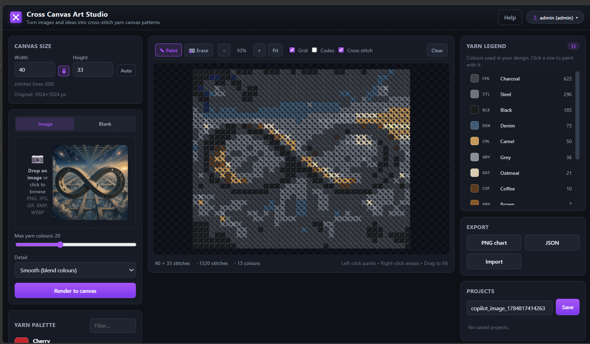

# Stitchee

**Cross Canvas Art Studio** — turn photos and ideas into **cross-stitch yarn canvas patterns**. Upload an
image and the app pixelates it to a grid of yarn colours, renders each stitch as a woven cross, and produces a printable colour legend telling you exactly which yarns and how many stitches of each are needed.



---

## Tools / Features


| Stitchee | Pixelator | Resizer | Palette | ASCII Art |
|---|---|---|---|---|
| Turn photos into stitchable yarn grids | Pixelate images into retro mosaics | Resize &amp; compress images | Extract colour palettes | Convert images &amp; text to ASCII |
| Yarn colour matching (52-colour palette) | Pixel size control (1–128 px) + presets | Width / height resize | Dominant-colour extraction | 10 character ramps (incl. custom) |
| Woven cross-stitch canvas with grid overlay | Max colour count (2–256) | Aspect-ratio lock | Visual palette strip | 5×5 block-letter banners from text |
| Paint / erase / fill tools | Favicon generator (16–512, rounded) | Percentage presets | Click a pixel to copy its colour | Full Unicode support |
| - | Before / after split comparison | Socials-size presets | Export HEX / CSS / JSON / PNG | Colored ASCII output |


---

## Live site — minimal production

**Stitchee is live at [https://stitchee.ca](https://stitchee.ca)** — a lightweight,
client-side build with no server, no accounts, and no backend storage. Pixelation, the
yarn legend, and saved projects all run in your browser (projects are kept in
`localStorage`).

Deployment is GitHub Pages via
[`.github/workflows/pages.yml`](.github/workflows/pages.yml), which runs
[`.github/scripts/build_site.py`](.github/scripts/build_site.py) to generate the static
site into `_site/` — a stripped-down build of the full app (no auth, no AI, no upload
backend).

### Rebuild locally

```sh
python .github/scripts/build_site.py   # regenerates ./_site
```

### Deploy

The Pages workflow redeploys automatically on every push to `main`, or run it manually
from **Actions → Stitchee - GitHub Pages → Run workflow**.

---

## Self-hosted (full app)

The full-featured app (accounts, AI design, file storage) runs in Docker:

### Docker Compose

```sh
# 1. Build & run
docker compose up --build
```

### Docker Hub Run
```sh
docker run \
   --name cross-canvas-art-studio \
   --hostname cross-canvas-art-studio \
   -p 9016:5000 \
   -v ./data:/data \
   jonesckevin/cross-canvas-art-studio:latest
```

**Open the app:** http://localhost:9016

---

## Configuration

All configuration is via environment variables (see `docker-compose.yml`).

| Variable | Default | Description |
|---|---|---|
| `DOCKER_PORT` | `9016` | Host port to publish. |
| `DATA_DIR` | `./data` | Host path mounted at `/data`. |
| `MAX_UPLOAD_MB` | `25` | Maximum upload size. |
| `SECRET_KEY`, `SECRETS` | *(auto)* | Signing keys; set for persistence. |
| `REQUIRE_SECRETS` | `false` | Refuse to start without `SECRETS`. |
| `ALLOW_AUTH` | `false` | Enable the accounts system. |
| `REQUIRE_AUTH` | `false` | Gate the whole app behind login. |
| `ALLOW_USER_REGISTRATION` | `true` | Allow self-registration. |
| `ALLOW_GUEST_LOGIN` | `true` | Allow ephemeral guest sessions. |
| `RP_ID` | `localhost` | WebAuthn relying party ID (use domain only, no port). |
| `ORIGIN` | `localhost,yarn` | Comma-separated accepted browser origins. |
| `OLLAMA_HOST` | `http://host.docker.internal:11434` | Local Ollama endpoint. |
| `LMSTUDIO_HOST` | `http://host.docker.internal:1234` | Local LM Studio endpoint. |
| `ALLOW_CLIENT_API_KEYS` | `true` | Allow browser-supplied cloud API keys. |
| `OPENAI_API_KEY` … | *(unset)* | Optional server-side cloud keys. |
| `CORS_ALLOWED_ORIGINS` | *(same-origin)* | `*`, or a comma-separated list. |
| `TRUST_PROXY` | `false` | Honour `X-Forwarded-*` behind a proxy. |

Static settings (yarn palette caps, grid limits, provider metadata) live in
[`App/config.json`](App/config.json).
